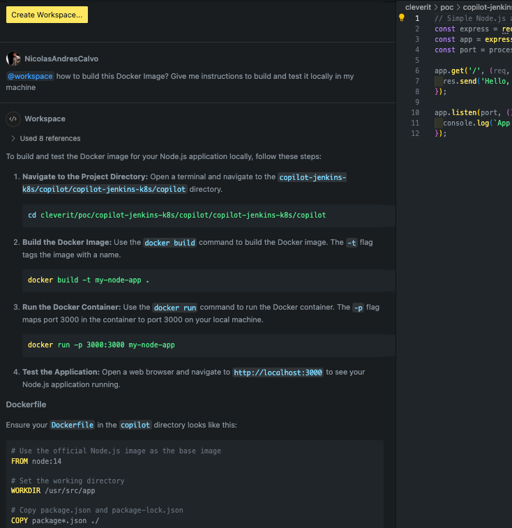
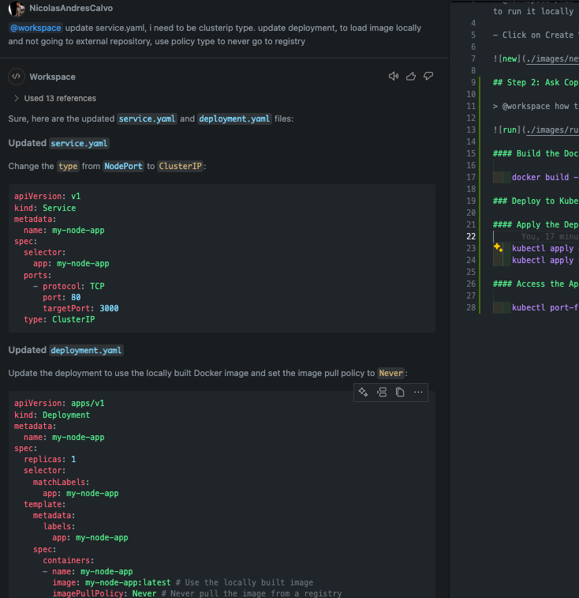

# My Node Application with Kubernetes, Jekins and Copilot

This project demonstrates how to deploy a simple Node.js application to a local Kubernetes cluster using **Kind** (Kubernetes in Docker). The Kubernetes manifests include a **Deployment** to run the application and a **Service** to expose the application via a **NodePort**.

## Prerequisites

Before running the application, ensure you have the following installed on your machine:

- [Docker](https://www.docker.com/products/docker-desktop)
- [Kind](https://kind.sigs.k8s.io/) (Kubernetes in Docker)
- [kubectl](https://kubernetes.io/docs/tasks/tools/install-kubectl/) (Kubernetes command-line tool)
- [Jenkins](https://hub.docker.com/repository/docker/nicolasandrescalvo/jenkins/general)

---

## Setting Up the Local Jenkins

### Step 1: Pull Docker Image

    # Pull a Docker Image already built
    docker pull nicolasandrescalvo/jenkins:v1.0

### Step 2: Run Jenkins Locally

    docker run -d --name jenkins \
      -p 8080:8080 \
      -p 50000:50000 \
      -v $(pwd)/jenkins_home:/var/jenkins_home \
      --privileged \
      -v /var/run/docker.sock:/var/run/docker.sock \
      nicolasandrescalvo/jenkins:v1.0

### Step 3: Extract Admin Secret

    docker exec jenkins cat /var/jenkins_home/secrets/initialAdminPassword

---

## Setting Up the Local Kubernetes Cluster

### Step 1: Create a Kind Cluster

To run Kubernetes locally, we will create a Kind cluster.

    # Create a new Kind cluster named 'jenkins'
    kind create cluster --name jenkins

### Step 2: Configure local Cluster

To configure a context we are making use of kubectl.

    # List all Contexts
    kubectl config get-contexts
    # Set Jenkins Context
    kubectl config set-cluster kind-jenkins

---

## Steps

### Step 1: Ask Copilot Chat to generate the workspace:

> @workspace /new inside copilot-jenkins-k8s repository in the copilot directory. Create a simple node js app. Dockerfile to run it. And k8s manifests to run it locally

- Click on Create Workspace.

### Step 2: Ask Copilot Chat how to run this app locally:

> @workspace how to build this Docker Image? Give me instructions to build and test it locally in my machine

#### Build the Docker Image:

    docker build -t my-node-app .

### Deploy to Kubernetes

#### Apply the Deployment and Service:

    kubectl apply -f k8s/deployment.yaml
    kubectl apply -f k8s/service.yaml

#### Access the Application:

    kubectl port-forward service/my-node-app 8080:80

### Step 3: Ask Copilot Chat how to update k8s manifest:

> @workspace update service.yaml, i need to be clusterip type. update deployment, to load image locally and not going to external repository, use policy type to never go to registry

### Step 2: Build the Docker Image Locally

Before deploying to Kubernetes, build the Docker image for the Node.js application.

    # Build the Docker image
    docker build -t my-node-app:latest .

### Step 3: Load the Docker Image into the Kind Cluster

Since Kind runs Kubernetes inside Docker containers, you need to load the Docker image into the Kind cluster.

    # Load the local Docker image into the Kind cluster
    kind load docker-image my-node-app:latest --name jenkins

### Step 4: Apply Kubernetes Manifests

Now that the image is loaded into the Kind cluster, apply the Kubernetes manifests to deploy the application.

    # Create a namespace and deploy the application
    kubectl apply -f k8s.yaml

### Step 5: Verify Deployment

Check the status of the pods to ensure the application is running:

    # Get the status of the pods
    kubectl get pods -n jenkins-ns

You should see two pods running.

### Step 6: Expose the Application

The service is exposed via **NodePort**. You can access the application on port `30080`.

    # Port forward the service to make it accessible in the browser
    kubectl port-forward service/my-app-service 8080:80 -n jenkins-ns

You can now access the application in your browser at:

    http://localhost:8080

### Step 7: Verify the Service

To check the status of the service, run the following command:

    kubectl get svc -n jenkins-ns

You should see something like:

    NAME             TYPE       CLUSTER-IP     EXTERNAL-IP   PORT(S)        AGE
    my-app-service   NodePort   10.96.179.44   <none>        80:30080/TCP   5m

### Cleaning Up

To delete the cluster and clean up resources:

    # Delete the Kind cluster
    kind delete cluster --name jenkins