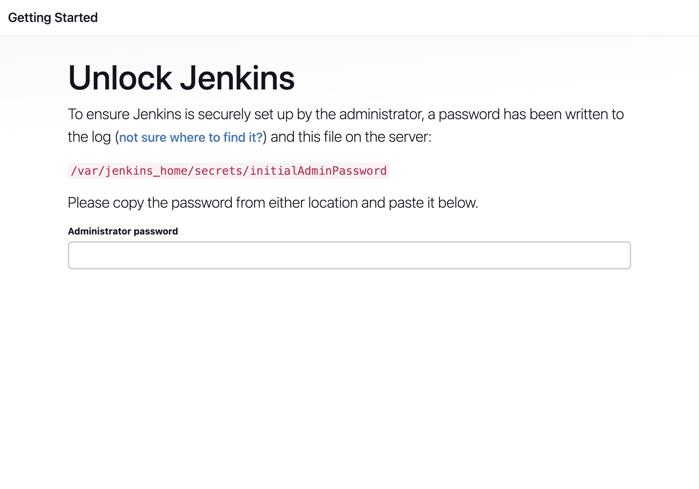

# DevOps optimizado con Kubernetes, Docker, Jenkins + GitHub Copilot 🤖

En este training, aprovecharemos el uso de GitHub copilot para construir un entorno de trabajo DevOps, que permita construir un flujo automatizado completo de principio a fin. Incorporando las mejores practicas del SDLC

El objetivo consistira en levantar un entorno local con Jenkins y publicar una aplicacion web generada desde cero con GitHub Copilot hacia un Registry de Docker, con la finalidad de poder desplegar nuestra aplicación en un entorno local de Kubernetes.

## 🚧 Requerimientos Tecnicos.

Los siguientes programas son **obligatorios** para completar este práctico.

1. [Docker](https://www.docker.com/products/docker-desktop): Se empleará como herramienta de ejecución de contenedores.
2. [Kind](https://kind.sigs.k8s.io/): Herramienta para la creacion de clusters de kubernetes utilizando contenedores de docker.
3. [Jenkins](https://www.jenkins.io/): Servidor de automatización open-source para construir, probar y desplegar aplicaciones.
4. [GitHub](https://github.com/): Como herramienta de versionamiento de codigo y alojamiento de repositorios.
5. [Docker Hub](https://hub.docker.com/): Servicio de alojamiento de imágenes de contenedores Docker.
1. [NodeJS](https://nodejs.org): Entorno de ejecucion en el servidor para el lenguaje JavaScript.

## 🛠️ 1. Configurando Jenkins localmente usando Docker.

- Abre una sesion de terminal en la carpeta `jenkins` localizada en este repositorio.
    ```shell
    cd "carpeta_del_repositorio/jenkins"
    ```

- Una vez abierta la terminal (Bash|Powershell), debes levantar el servicio de jenkins mediante docker compose, usando los siguientes comandos:
    ```shell
    docker compose build # Descarga las imagenes docker necesarias y contruye los contenedores.

    docker compose up -d # Inicializa y levanta los contenedores de docker. Ejecuta la aplicacion de Jenkins. 
    ```
- Extrae la constraseña de seguridad de jenkins. (Será necesaria para desbloquear jenkins y configurarlo). La constraseña puede ser extraida empleando el siguiente comando:
    ```shell
    docker exec jenkins cat /var/jenkins_home/secrets/initialAdminPassword

    # El valor retornado sera un string similar a este:
    # 3ef9768dafa8429c870e45b68d96d651
    ```
- Abre el navegador y navega hasta la direccion: `http://localhost:8080`. Una vez alli introduce la clave de desbloqueo obtenida en el paso anterior.
    .

> Usuario Jenkins 💡:  
Alternativamente jenkins pedira crear un usuario y contraseña para gestionar la herramienta. Es opcional para este practico pudiendo usarse el usuario administrador.

## 🖥️ 2. Configurando Kubernetes localmente usando Kind.
Lo primero que se debe hacer es crear un nuevo cluster utilizando Kind mediante el siguiente comando:
```sh
kind create cluster --name devops-demo
```

Ahora lo siguiente es obtener el contexto del cluster, el contexto es un archivo que nos permitira conectarnos al api de control de nuestro cluster mediante la linea de comandos `kubectl`

Para ello ejecutamos el siguiente comando:
```sh
kubectl cluster-info --context kind-devops-demo
```

Si queremos validar que el contexto ha sido configurado y que se encuentra activo, se puede verificar ejecutando el siguiente comando:
```sh
kubectl config get-contexts
```
Esto devolvera la una salida similar a la siguiente:
```sh
CURRENT   NAME               CLUSTER            AUTHINFO           NAMESPACE
*         kind-devops-demo   kind-devops-demo   kind-devops-demo
```
En caso de tener varios contextos, es importante verificar que el contexto `kind-devops-demo` se encuentre marcado con un asterisco (*).

## 🚀 3. Creando repositorio en GitHub
En este paso, crearemos un nuevo repositorio publico en nuestras personales de GitHub. El objetivo de este repositorio es alojar la aplicacion web que Copilot se encargara de generar por nosotros.

A su vez, usaremos este repositorio en nuestra instancia local de Jenkins y asi desplegar la aplicacion web.

Podemos indicar a GitHub Copilot que nos oriente con los pasos para crear un repositorio mediante el siguiente prompt:

_Prompt de ejemplo:_
```
Puedes indicar los pasos necesarios para crear un nuevo repositorio publico en GitHub llamado "demo-solar-system-app" El repositorio debe contener un README y un gitignore. Que pasos debo segur.
```

**Debemos seguir las sugerencias indicadas por GitHub Copilot en este punto.**

Una vez completado este paso. Clonamos el repositorio creado en nuestro computador y abriremos el repositorio con visual estudio code.

## 🧑🏼‍💻 4. Creando aplicacion web de pruebas.
En este paso crearemos una aplicacion web simple que servira como servicio de pruebas de este practico. Esta aplicacion la alojaremos en el repositorio de GitHub creado en el paso anterior.

Utilizaremos las extensiones de GitHub Copilot, especificamente `@workspace` y tambien la caracteristica de `Copilot Edits` que permitira realizar cambios dinamicos a los archivos de nuestra aplicacion.

> **RECOMENDACION** 🚧  
> Para mejores resultados en la generacion de proyectos, utiliza @workspace /new con el modelo de: OpenAI O1 (Preview).

**PROMPT A UTILIZAR:**
```
@workspace /new Quiero que construyas la estructura de un nuevo proyecto web para un sitio web estatico. El sitio consta de tres paginas principales: Index, About y Contact Us. El sitio web esta pensado para mostrar informacion del sistema solar y tiene como nombre: "app". Por lo que debes plasmar la informacion de los planetas que conforman el sistema solar: Mercurio, Venus, Tierra, Marte, Jupiter, Saturno, Urano y Neptuno. En algunas partes reconocen a pluton como planeta. Por lo tanto incluye informacion tambien de pluton. Y no puedes olvidar incluir al Sol y toda su informacion relevante. Eso ira en la pagina index. En la pagina de about us. Coloca que somos un pequeño grupo de personas aficionadas a la astronomia y tenemos como mision educar y transmitir informacion sobre los planetas. (En esta parte como modelo de IA debes generar contenido enriquecido y util). Y por ultimo en la pagina de Contact Us, crea un formulario de contacto que permita recolectar la siguiente informacion: Nombres, Apellidos, Correo Electronico, Pais, y un gran campo de texto que permita a los usuarios escribir sus anecdotas.

Este sitio web debe ser desarrollado utilizando HTML5, CSS3, JavaScript y utilizar la version mas reciente de Boostrap como libreria de estilos y componentes. Para aprovisionar este sitio web debes utilizar NodeJS con el framework de ExpressJS para asi aprovisionar y disponibilizar este sitio web estatico. Toda la estructura de esta aplicacion debes crearla dentro de una carpeta llamada "app" que debe ubicarse en el directorio raíz de este repositorio. Es muy importante que no repitas las paginas web es decir no generes dos veces la misma pagina y sobretodo, no olvides generar el archivo .gitignore para este proyecto.
```

**Troubleshooting: .gitignore**  
Si el archivo `.gitignore` no es generado durante el uso del comando. Simplemente crea un nuevo archivo `.gitignore` dentro de la carpeta `app` y usando la combinacion de teclas `ctrl`+`i` en Windows ó `cmd`+`i` en MacOS, abriras el chat copilot "in-line". Escribe el siguiente prompt para que Copilot genere una estructura básica de .gitignore por ti.

**PROMPT A UTILIZAR**
```
Agrega una estrctura basica de un archivo .gitignore
```

### Contenerizando la aplicacion
Necesitamos ejecutar la aplicacion creada por copilot, para ello le pediremos al chat que nos ayude a crear un archivo Dockerfile. Este archivo contendra todas las dependencias necesarias para que podamos ejecutar la aplicacion, y tambien permitira que podamos deployarla posteriormente en el cluster de Kubernetes creado anteriormente.

_Prompt para contenerizar la aplicacion:_
```
@workspace Construye un archivo Dockerfie que permita deployar el sitio web estatico que se encuentra dentro de la carpeta "app" #file:server.js
```

1. Crea un nuevo archivo `Dockerfile`
2. Copia la sugerencia de copilot en el archivo Dockerfile.
3. Guarda los cambios.

### Ejecutando la aplicacion
Para probar la aplicacion consultaremos con copilot que comandos necesitamos para construir la imagen docker y ejecutar la aplicacion web mediante el siguiente prompt.

**PROMPT A UTILIZAR**
```
@workspace Que comandos Docker necesito para construir y ejecutar mi aplicacion web declarada en el siguiente Dockerfile #file:Dockerfile
```

Copilot muy probablemente sugerirá los siguientes comandos:
```sh
docker build -t solar-system-app:latest . # Construye la imagen docker en nuestro computador de forma local

docker run -p 3000:3000 --name solar-system-website solar-system-app:latest # Crea y ejecuta un contenedor levantando el sitio web
```

## 🔧 5. Creando  el archivo jenkinsfile
Dentro del repositorio de la aplicacion web, debemos crear un archivo `jenkinsfile` el cual contendra el codigo y la definicion del pipeline que emplearemos dentro de Jenkins.

_Prompt para crear el jenkinsfile:_
```
@workspace Crea un archivo jenkins file que permita construir y publicar la imagen docker de esta aplicacion web. El pipeline debe incluir las etapas de instalacion de dependencias, empaquetado de la imagen de docker y entrega de la misma en un container registry. Como registry estaremos usando Docker Hub, por lo que debes incluir el uso de credenciales en los pasos de docker. #file:Dockerfile
```

Con esto copilot sugerira una estructura de pipeline base la cual modificaremos un poco mas adelante.

## 🖥️ 6. Creando manifiesto de kubernetes (Deploment)
Usando GitHub Copilot, solicitaremos la creacion del manifiesto de kubernetes que utilizaremos para despleagar la aplicacion web dentro del cluster que hemos generado anteriormente. Mediante el siguiente prompt:

_Prompt: Manifiesto de kubernetes:_
```
@workspace Crea un archivo k8s.yaml. Este manifiesto de kubernetes debe contener un deployment de la imagen docker que creamos anteriormente #file:Dockerfile y debe coincidir con la URL del repositorio docker en #file:jenkinsfile. Cluster IP debe implementarse como un servicio y esta aplicación web debe ser accesible solo internamente.
```

Al ejecutar este prompt Copilot sugerira la estructura YAML necesaria para ejecutar el deployment.

El codigo sugerido lo guardaremos en un nuevo archivo llamado `k8s.yaml` el cual crearemos en la raiz del repositorio.

## ⚡ 7. Configurando Docker Registry.

Lo primero que configuraremos en este apartado es nuestro Docker Registry o Container Registry, el cual servira de repositorio de almacenamiento para la imagen Docker de nuestra aplicacion web. Para ello utilizaremos **Docker Hub**. Utilizando github copilot consultaremos como podemos utilizar docker hub con nuestro repositorio de Docker.

Para realizar estas modificaciones emplearemos **GitHub Copilot Edits**. Una caracteristica de GitHub Copilot que permite modificar varios archivos de un espacio de trabajo simultaneamente.

Es importante recalcar que agregaremos al "working set" se Copilot Edits los archivos de `jenkinsfile`

```
 Quiero configurar mi cuenta de Docker Hub como repositorio de imagenes de docker. Modifica el archivo jenkins y el archivo de deployment de kubernetes para que incluyan el siguiente usuario de Docker Hub en la ruta de la imagen docker resultado de la siguiente manera: macmoi/solar-system-app:latest
```

Copilot realizara modificacion dentro de los archivos `jenkinsfile` y `k8s.yaml` modificando concretamente las lineas de codigo en donde indicamos la ruta de la imagen en el repositorio. Esto permitira configurar de forma correcta nuestro usuario de docker

> 🚧 **Importante: Usuario Docker**  
> En este ejemplo, se emplea un usuario docker de pruebas. Ese usuario para ejecuciones particulares debe sustituirse por su propio usuario. Ejemplo: Para un usuario llamado `prueba` la ruta de la imagen resultaria en: `prueba/solar-system-app:latest`

## ☁️ 8. Subiendo los cambios al repositorio.
Una vez realizadas todas las configuraciones y modificaciones necesarias a la aplicacion, procedemos a subir los cambios al repositorio Git creado anteriormente.

Para ello simplemente ejecutamos los siguientes comandos:

```sh
git status # Verificamos el estado actual de la rama.
git add . # Agregamos todos los cambios realizados.
git commit -m "Primeros cambios" # Registramos una incorporacion de cambios
git push # Se suben los cambios al repositorio de Git
```
> 🎯 **Nota:** **Incorporaciones**
> Es posible que dependiendo del metodo de autenticacion de sus repositorios,
> se solicite una key o en su lugar configurar SSH para asi autenticarse, en ese caso,
> deben seguir los pasos de su herramienta de control de versiones para autenticarse.
> En el caso de GitHub por ejemplo estos son los pasos:
> [Crear un nuevo par de claves SSH](https://docs.github.com/en/authentication/connecting-to-github-with-ssh/generating-a-new-ssh-key-and-adding-it-to-the-ssh-agent) y 
> [agregar clave SSH a cuenta GitHub](https://docs.github.com/en/authentication/connecting-to-github-with-ssh/adding-a-new-ssh-key-to-your-github-account)

## Configuracion de Pipeline Jenkins y GitHub
En este punto utilizaremos GitHub copilto como asistente de ayuda para que nos guie en la configuracion de un nuevo pipeline en Jenkins mediante el siguiente prompt.

```
@workspace Necesito que proporciones los pasos necesarios para configurar esta aplicacion en un pipeline automatizado de Jenkins #file:jenkinsfile
```