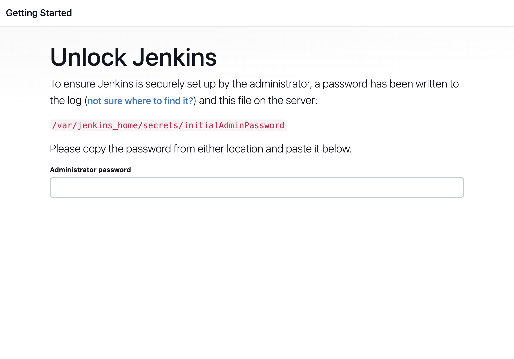

# My Node Application with Kubernetes, Jenkins, and GitHub Copilot

This project demonstrates how to deploy a simple Node.js application to a local Kubernetes cluster using **Kind** (Kubernetes in Docker), **Jenkins** for continuous integration, and **GitHub Copilot** to automate development tasks.

---

## Prerequisites

Ensure the following are installed on your machine:

- [Docker](https://www.docker.com/products/docker-desktop) - For containerization
- [Kind](https://kind.sigs.k8s.io/) - Kubernetes in Docker
- [kubectl](https://kubernetes.io/docs/tasks/tools/install-kubectl/) - Kubernetes command-line tool
- [Jenkins](https://hub.docker.com/repository/docker/nicolasandrescalvo/jenkins/general) - For CI/CD pipelines
- [GitHub Account](https://github.com/)
- [DockerHub Account](https://hub.docker.com/)

---

## Setting Up Jenkins Locally

### Step 1: Pull the Pre-built Jenkins Docker Image

Pull the pre-built Docker image for Jenkins:

    docker pull nicolasandrescalvo/jenkins:v1.0

### Step 2: Run Jenkins Locally

Run the Jenkins container:

    docker run -d --name jenkins \
      -p 8080:8080 \
      -p 50000:50000 \
      -v $(pwd)/jenkins_home:/var/jenkins_home \
      --privileged \
      -v /var/run/docker.sock:/var/run/docker.sock \
      nicolasandrescalvo/jenkins:v1.0

### Step 3: Extract Admin Secret

After starting Jenkins, extract the admin password:

    docker exec jenkins cat /var/jenkins_home/secrets/initialAdminPassword

Access Jenkins at `http://localhost:8080`, and use the admin password to log in:

---

## Setting Up the Local Kubernetes Cluster

### Step 1: Create a Kind Cluster

To run Kubernetes locally, create a Kind cluster named `jenkins`:

    kind create cluster --name jenkins

### Step 2: Configure the Local Kubernetes Cluster

Use `kubectl` to configure the Kubernetes context:

    kubectl config get-contexts
    kubectl config set-cluster kind-jenkins

---

## Workflow with GitHub Copilot

### Step 1: Generate the Workspace

Ask GitHub Copilot Chat to generate the project workspace:

> @workspace /new inside copilot-jenkins-k8s repository in the copilot directory. Create a simple Node.js app, a Dockerfile to run it, and Kubernetes manifests to run it locally.

Lets click on ***"Create Workspace"*** and then select the directory to create the files

### Step 2: Generate the Jenkinsfile

Use GitHub Copilot to generate the `Jenkinsfile`:

> @workspace now I need a Jenkinsfile to build and push this solution.

### Step 3: Update Jenkinsfile

Ask GitHub Copilot Chat to update the `Jenkinsfile` to include Docker registry settings:

> @workspace update the `Jenkinsfile`. The repository is: https://github.com/NicolasAndresCalvo/copilot-jenkins-k8s, and the Docker Registry to push the image is: `nicolasandrescalvo/copilot-jenkins-k8s`. Docker Credential is stored in Jenkins under this ID: `DOCKERHUB-PAT`.

### Step 4: Update K8S

Ask GitHub Copilot Chat to update the `K8S` to include Docker Image and update Service Type:

> @workspace Update k8s.yaml, i want the deployment to use an image that i am going to create and push in Docker Hub, the url should be: `nicolasandrescalvo/copilot-jenkins-k8s`. Service shoulb be ClusterIP, only accesible inside the cluster.

### Step 5: Provide Commands to run app locally

Ask GitHub Copilot Chat to provide commands to run app locally:

> @workspace give me commands to run it locally. With Docker Desktop on Mac. Also to push it to my DockerHub Registry: nicolasandrescalvo/copilot-jenkins-k8s

### Step 6: Provide Instructions for Jenkins Credential and Jenkinsfile

Ask GitHub Copilot Chat to provide instructions on how to create a credential on Jenkins:

> @workspace give me instructions on how to create a credential on Jenkins to store a Docker PAT, then its going to be used for my jenkinsfile, and should be named DOCKERHUB_PAT

### Step 7: Create Pipeline on Jenkins

Ask GitHub Copilot Chat to provide instructions on how to create a pipeline on Jenkins:

> @workspace give me instructions on how to create a simple pipeline on Jenkins to make use of jenkinsfile, store in the repository https://github.com/NicolasAndresCalvo/copilot-jenkins-k8s.git on GitHub. Its a public repository

### Step 8: Create a repository on GitHub

Ask GitHub Copilot Chat to provide instructions on how to create a repository on GitHub:

> @workspace provide instructions on how to create a GitHub repository, a public. And give me commands to commit and push all files generated here

### Step 9: Create README.md

Ask GitHub Copilot Chat to create a README.md with all instructions and command:

> @workspace create a README.md with all information and instructions so anyone can take it and run the whole application

### Step 10: Run a Pipeline on Jenkins

Ask GitHub Copilot Chat to provide instructions to run a pipeline on Jenkins:

> @workspace provide instructions on how to test application on Jenkins

---

## Testing the App Locally with Docker and Kubernetes

### Step 1: Build the Docker Image

Before deploying to Kubernetes, build the Docker image for the Node.js application:

    docker build -t my-node-app:latest .

### Step 2: Load the Docker Image into the Kind Cluster

Since Kind runs Kubernetes inside Docker containers, load the image into the Kind cluster:

    kind load docker-image my-node-app:latest --name jenkins

### Step 3: Apply the Kubernetes Manifests

Apply the Kubernetes manifests to deploy the application. Ensure the deployment includes `imagePullPolicy: Never` to use the local image:

    kubectl apply -f k8s.yaml

### Step 4: Verify the Deployment

Check the status of the pods:

    kubectl get pods -n jenkins-ns

You should see two pods running.

### Step 5: Expose the Application

The application is exposed via a **NodePort**. Use `kubectl` to port forward and access the app in your browser:

    kubectl port-forward service/my-app-service 8080:80 -n jenkins-ns

Access the app in your browser at:

    http://localhost:8080

### Step 6: Verify the Service

To check the status of the service, run the following command:

    kubectl get svc -n jenkins-ns

You should see something like:

    NAME             TYPE       CLUSTER-IP     EXTERNAL-IP   PORT(S)        AGE
    my-app-service   NodePort   10.96.179.44   <none>        80:30080/TCP   5m

### Cleaning Up

To delete the cluster and clean up resources:

    # Delete the Kind cluster
    kind delete cluster --name jenkins
---

